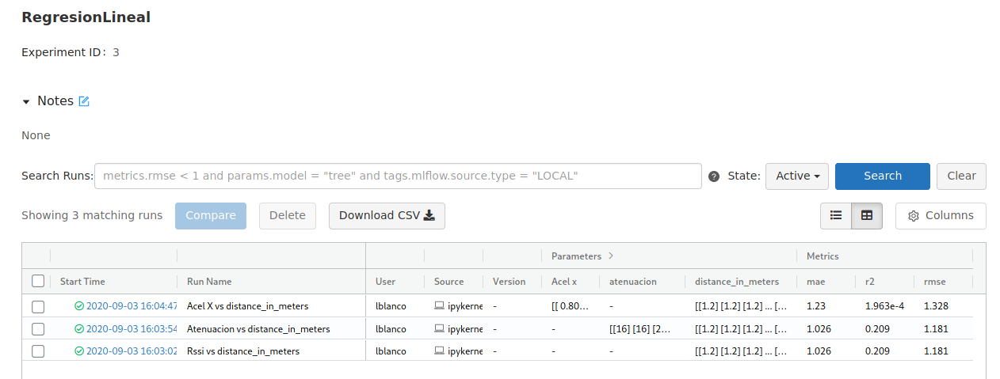

## Como usar _MLFLOW_

- En la computadora instalar herramienta:
`pip install mlflow`

- En el codigo importar libreria:
~~~  
import mlflow  
import mlflow.sklearn  
from sklearn.metrics import mean_squared_error, mean_absolute_error, r2_score
~~~
- Entrenar modelo:
~~~
x = da['atenuacion'].values.reshape(-1,1)
y = df['distance_in_meters'].values.reshape(-1,1)

x_train, x_test, y_train, y_test = train_test_split(x,y, test_size=0.2, random_state=0)
regressor = LinearRegression()

regressor.fit(x_train, y_train)
~~~

- Predecir resultados:
~~~
y_pred = regressor.predict(x_test)
~~~

- Calcular errores que se usan como metrica:
~~~
rmse = np.sqrt(mean_squared_error(y_test, y_pred))
mae = mean_absolute_error(y_test, y_pred)
r2 = r2_score(y_test, y_pred)
~~~

- Crear experimento:  
(Es importante guardar el id del experimento porque se usa para guardar en el las corridas)
~~~
experiment = mlflow.create_experiment("Regresion Lineal")
~~~

- Iniciar corrida:
~~~ 
#Numero de experimento y nombre de corrida
mlflow.start_run(experiment_id=experiment, run_name='At vs rssi')

#Parametros que se tuvieron en cuenta. Por ejemplo: Distancias de 1.2m
mlflow.log_param("atenuacion", x)
mlflow.log_param("distance_in_meters", y)

#Metricas que vamos a evaluar, en este caso errores:
mlflow.log_metric("rmse", rmse)
mlflow.log_metric("r2", r2)
mlflow.log_metric("mae", mae)

#Se finaliza la corrida
mlflow.end_run()
~~~

- Los datos de mlflow se guardan en una carpeta _miruns_, ir a la carpeta que la contiene y en consola usar:
`miflow ui`

- Abrir en navegador la direccion del programa: `http://localhost:5000`

- Comparar datos.  
 

- Links utiles:

[MLflow - API](https://www.mlflow.org/docs/latest/python_api/mlflow.html).  
[MLflow.sklearn - API](https://www.mlflow.org/docs/latest/python_api/mlflow.sklearn.html).

